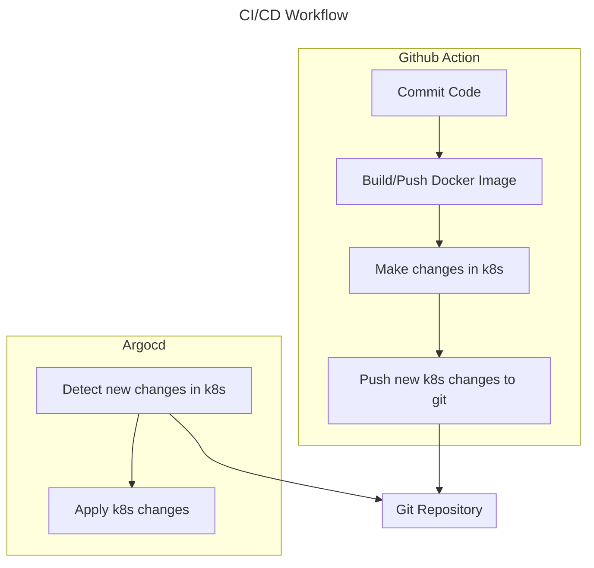

# 1. Description
- This repository contains source code for my VTI DevOps course.
# 2. Project
## 2.1 Overview

## 2.2 Task
 - Jenkins Runner configuration
 - (Optional) Host the Jenkins with Docker server on AWS EC2 by using Terraform.
 - WebHook configuration
 - Dockerizing python application
 - k8s Manifest file creation
 - Connect Kubetnetes node to ArgoCD
 - Connect private Github Repo to ArgoCD for CD part
 - Trigger CD Jenkins Job using Curl command and Pass variable from CI pipelines

